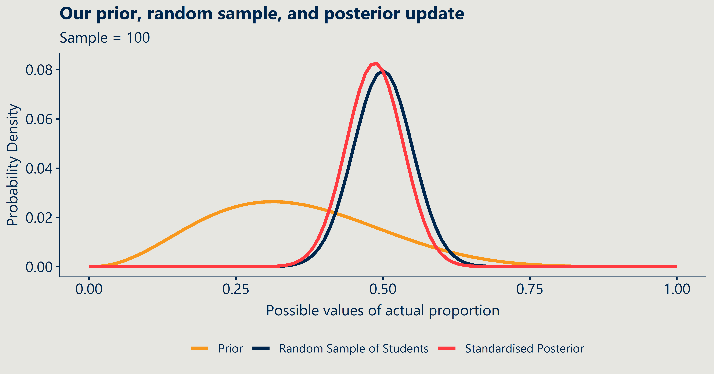
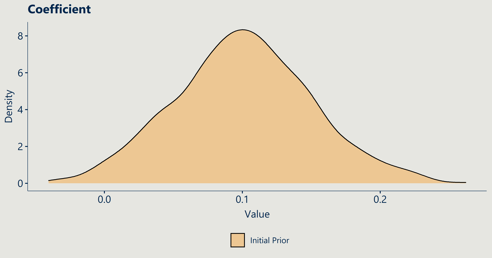
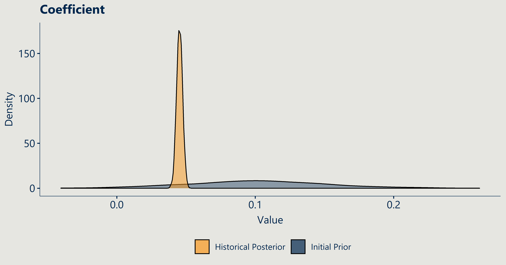
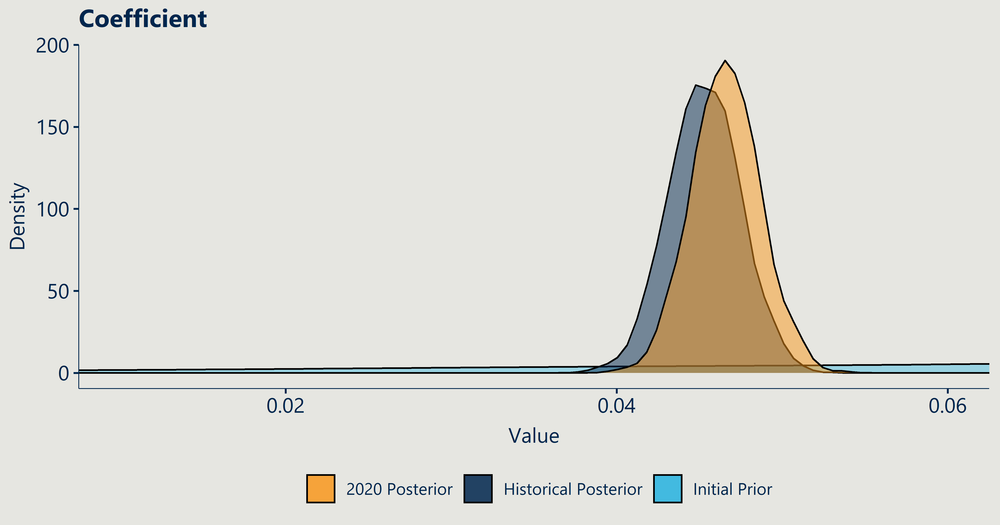

<style>
.small-code pre code {
  font-size: 1em;
}
</style>

Intro to Bayesian Analysis in R
========================================================
author: Trent Henderson
date: 29 January 2021
autosize: true
css: corp-styles.css
transition: linear

Goals of the presentation
========================================================
class: small-code

This interactive talk aims to help you achieve three things:

- Develop an initial understanding of Bayes rule and how to apply it
- Develop an intuition for when to consider a Bayesian approach at Nous
- Understand how to run and interpret basic Bayesian regression models in R

All the code for today is in a [GitLab repository](https://gitlab.com/Henderson.T/r-club-intro-bayes).


When to consider Bayesian statistics at Nous
========================================================

If the answer is yes to any of the following, you might want to consider a Bayesian approach for your project:

* Are you receiving drip-feed data that requires you to update your model(s)?
* Do you have strong subject matter knowledge or prior understanding of the relationships of interest you wish to incorporate?
* Is there a large degree of uncertainty to incorporate in the analysis?

Activity
========================================================

## Consider the following question:

**I am an undergraduate international student studying at an Australian university. Do you think I am at a Go8 university?**

What do you think the probability of an international student being at a Go8 university is?


```r
nous_responses <- c(0.7,0.7,0.3,0.4,0.5,0.8,0.8,0.6,0.6)
```

Activity Step 1: Specify our beliefs
========================================================
class: small-code

## P(Go8)

We can use a [function I have written](https://gitlab.com/Henderson.T/intro-to-bayes/-/blob/master/R/calcs-by-hand.R) to turn these guesses into a table that is easy to understand.


<div class="tabwid"><style>.cl-9d672628{border-collapse:collapse;}.cl-9d6073dc{font-family:'Segoe UI Semibold';font-size:24pt;font-weight:bold;font-style:normal;text-decoration:none;color:rgba(0, 38, 77, 1.00);background-color:transparent;}.cl-9d6073dd{font-family:'Segoe UI';font-size:22pt;font-weight:normal;font-style:normal;text-decoration:none;color:rgba(0, 0, 0, 1.00);background-color:transparent;}.cl-9d6073de{margin:0;text-align:center;border-bottom: 0 solid rgba(0, 0, 0, 1.00);border-top: 0 solid rgba(0, 0, 0, 1.00);border-left: 0 solid rgba(0, 0, 0, 1.00);border-right: 0 solid rgba(0, 0, 0, 1.00);padding-bottom:3pt;padding-top:3pt;padding-left:3pt;padding-right:3pt;line-height: 1;background-color:transparent;}.cl-9d6073df{margin:0;text-align:left;border-bottom: 0 solid rgba(0, 0, 0, 1.00);border-top: 0 solid rgba(0, 0, 0, 1.00);border-left: 0 solid rgba(0, 0, 0, 1.00);border-right: 0 solid rgba(0, 0, 0, 1.00);padding-bottom:3pt;padding-top:3pt;padding-left:3pt;padding-right:3pt;line-height: 1;background-color:transparent;}.cl-9d6073e0{margin:0;text-align:right;border-bottom: 0 solid rgba(0, 0, 0, 1.00);border-top: 0 solid rgba(0, 0, 0, 1.00);border-left: 0 solid rgba(0, 0, 0, 1.00);border-right: 0 solid rgba(0, 0, 0, 1.00);padding-bottom:3pt;padding-top:3pt;padding-left:3pt;padding-right:3pt;line-height: 1;background-color:transparent;}.cl-9d609ace{width:139pt;background-color:transparent;vertical-align: middle;border-bottom: 1pt solid rgba(217, 217, 217, 1.00);border-top: 0 solid rgba(0, 0, 0, 1.00);border-left: 0 solid rgba(0, 0, 0, 1.00);border-right: 0 solid rgba(0, 0, 0, 1.00);margin-bottom:4pt;margin-top:4pt;margin-left:7pt;margin-right:7pt;}.cl-9d609acf{width:139pt;background-color:transparent;vertical-align: middle;border-bottom: 1pt solid rgba(217, 217, 217, 1.00);border-top: 0 solid rgba(0, 0, 0, 1.00);border-left: 0 solid rgba(0, 0, 0, 1.00);border-right: 0 solid rgba(0, 0, 0, 1.00);margin-bottom:4pt;margin-top:4pt;margin-left:7pt;margin-right:7pt;}.cl-9d609ad0{width:139pt;background-color:transparent;vertical-align: middle;border-bottom: 1pt solid rgba(217, 217, 217, 1.00);border-top: 1pt solid rgba(217, 217, 217, 1.00);border-left: 0 solid rgba(0, 0, 0, 1.00);border-right: 0 solid rgba(0, 0, 0, 1.00);margin-bottom:4pt;margin-top:4pt;margin-left:7pt;margin-right:7pt;}.cl-9d609ad1{width:139pt;background-color:transparent;vertical-align: middle;border-bottom: 1pt solid rgba(217, 217, 217, 1.00);border-top: 1pt solid rgba(217, 217, 217, 1.00);border-left: 0 solid rgba(0, 0, 0, 1.00);border-right: 0 solid rgba(0, 0, 0, 1.00);margin-bottom:4pt;margin-top:4pt;margin-left:7pt;margin-right:7pt;}.cl-9d609ad2{width:139pt;background-clip: padding-box;background-color:rgba(217, 217, 217, 1.00);vertical-align: middle;border-bottom: 0 solid rgba(0, 0, 0, 1.00);border-top: 3pt solid rgba(248, 152, 29, 1.00);border-left: 1pt solid rgba(255, 255, 255, 1.00);border-right: 0 solid rgba(0, 0, 0, 1.00);margin-bottom:4pt;margin-top:4pt;margin-left:7pt;margin-right:7pt;}.cl-9d609ad3{width:139pt;background-clip: padding-box;background-color:rgba(217, 217, 217, 1.00);vertical-align: middle;border-bottom: 0 solid rgba(0, 0, 0, 1.00);border-top: 3pt solid rgba(248, 152, 29, 1.00);border-left: 0 solid rgba(0, 0, 0, 1.00);border-right: 1pt solid rgba(255, 255, 255, 1.00);margin-bottom:4pt;margin-top:4pt;margin-left:7pt;margin-right:7pt;}</style><table class='cl-9d672628'><thead><tr style="overflow-wrap:break-word;"><td class="cl-9d609ad3"><p class="cl-9d6073de"><span class="cl-9d6073dc">hypothesis</span></p></td><td class="cl-9d609ad2"><p class="cl-9d6073de"><span class="cl-9d6073dc">degree_of_belief</span></p></td></tr></thead><tbody><tr style="overflow-wrap:break-word;"><td class="cl-9d609acf"><p class="cl-9d6073df"><span class="cl-9d6073dd">Go8</span></p></td><td class="cl-9d609ace"><p class="cl-9d6073e0"><span class="cl-9d6073dd">0.6</span></p></td></tr><tr style="overflow-wrap:break-word;"><td class="cl-9d609ad1"><p class="cl-9d6073df"><span class="cl-9d6073dd">non-Go8</span></p></td><td class="cl-9d609ad0"><p class="cl-9d6073e0"><span class="cl-9d6073dd">0.4</span></p></td></tr></tbody></table></div>

Activity Step 2: Understand what the actual data says
========================================================
class: small-code

## P(International | Go8)

We can pull the 'real' data from DAWN easily and calculate the proportions (probability) for each combination of Go8/non-Go8 and citizenship:


<div class="tabwid"><style>.cl-9df07b62{border-collapse:collapse;}.cl-9dea64d4{font-family:'Segoe UI Semibold';font-size:24pt;font-weight:bold;font-style:normal;text-decoration:none;color:rgba(0, 38, 77, 1.00);background-color:transparent;}.cl-9dea64d5{font-family:'Segoe UI';font-size:22pt;font-weight:normal;font-style:normal;text-decoration:none;color:rgba(0, 0, 0, 1.00);background-color:transparent;}.cl-9dea64d6{margin:0;text-align:center;border-bottom: 0 solid rgba(0, 0, 0, 1.00);border-top: 0 solid rgba(0, 0, 0, 1.00);border-left: 0 solid rgba(0, 0, 0, 1.00);border-right: 0 solid rgba(0, 0, 0, 1.00);padding-bottom:3pt;padding-top:3pt;padding-left:3pt;padding-right:3pt;line-height: 1;background-color:transparent;}.cl-9dea64d7{margin:0;text-align:left;border-bottom: 0 solid rgba(0, 0, 0, 1.00);border-top: 0 solid rgba(0, 0, 0, 1.00);border-left: 0 solid rgba(0, 0, 0, 1.00);border-right: 0 solid rgba(0, 0, 0, 1.00);padding-bottom:3pt;padding-top:3pt;padding-left:3pt;padding-right:3pt;line-height: 1;background-color:transparent;}.cl-9dea64d8{margin:0;text-align:right;border-bottom: 0 solid rgba(0, 0, 0, 1.00);border-top: 0 solid rgba(0, 0, 0, 1.00);border-left: 0 solid rgba(0, 0, 0, 1.00);border-right: 0 solid rgba(0, 0, 0, 1.00);padding-bottom:3pt;padding-top:3pt;padding-left:3pt;padding-right:3pt;line-height: 1;background-color:transparent;}.cl-9dea8bbc{width:139pt;background-color:transparent;vertical-align: middle;border-bottom: 1pt solid rgba(217, 217, 217, 1.00);border-top: 0 solid rgba(0, 0, 0, 1.00);border-left: 0 solid rgba(0, 0, 0, 1.00);border-right: 0 solid rgba(0, 0, 0, 1.00);margin-bottom:4pt;margin-top:4pt;margin-left:7pt;margin-right:7pt;}.cl-9dea8bbd{width:139pt;background-color:transparent;vertical-align: middle;border-bottom: 1pt solid rgba(217, 217, 217, 1.00);border-top: 0 solid rgba(0, 0, 0, 1.00);border-left: 0 solid rgba(0, 0, 0, 1.00);border-right: 0 solid rgba(0, 0, 0, 1.00);margin-bottom:4pt;margin-top:4pt;margin-left:7pt;margin-right:7pt;}.cl-9dea8bbe{width:139pt;background-color:transparent;vertical-align: middle;border-bottom: 1pt solid rgba(217, 217, 217, 1.00);border-top: 1pt solid rgba(217, 217, 217, 1.00);border-left: 0 solid rgba(0, 0, 0, 1.00);border-right: 0 solid rgba(0, 0, 0, 1.00);margin-bottom:4pt;margin-top:4pt;margin-left:7pt;margin-right:7pt;}.cl-9dea8bbf{width:139pt;background-color:transparent;vertical-align: middle;border-bottom: 1pt solid rgba(217, 217, 217, 1.00);border-top: 1pt solid rgba(217, 217, 217, 1.00);border-left: 0 solid rgba(0, 0, 0, 1.00);border-right: 0 solid rgba(0, 0, 0, 1.00);margin-bottom:4pt;margin-top:4pt;margin-left:7pt;margin-right:7pt;}.cl-9dea8bc0{width:139pt;background-clip: padding-box;background-color:rgba(217, 217, 217, 1.00);vertical-align: middle;border-bottom: 0 solid rgba(0, 0, 0, 1.00);border-top: 3pt solid rgba(248, 152, 29, 1.00);border-left: 1pt solid rgba(255, 255, 255, 1.00);border-right: 1pt solid rgba(255, 255, 255, 1.00);margin-bottom:4pt;margin-top:4pt;margin-left:7pt;margin-right:7pt;}.cl-9dea8bc1{width:139pt;background-clip: padding-box;background-color:rgba(217, 217, 217, 1.00);vertical-align: middle;border-bottom: 0 solid rgba(0, 0, 0, 1.00);border-top: 3pt solid rgba(248, 152, 29, 1.00);border-left: 0 solid rgba(0, 0, 0, 1.00);border-right: 1pt solid rgba(255, 255, 255, 1.00);margin-bottom:4pt;margin-top:4pt;margin-left:7pt;margin-right:7pt;}.cl-9dea8bc2{width:139pt;background-clip: padding-box;background-color:rgba(217, 217, 217, 1.00);vertical-align: middle;border-bottom: 0 solid rgba(0, 0, 0, 1.00);border-top: 3pt solid rgba(248, 152, 29, 1.00);border-left: 1pt solid rgba(255, 255, 255, 1.00);border-right: 0 solid rgba(0, 0, 0, 1.00);margin-bottom:4pt;margin-top:4pt;margin-left:7pt;margin-right:7pt;}</style><table class='cl-9df07b62'><thead><tr style="overflow-wrap:break-word;"><td class="cl-9dea8bc1"><p class="cl-9dea64d6"><span class="cl-9dea64d4">provider_group</span></p></td><td class="cl-9dea8bc0"><p class="cl-9dea64d6"><span class="cl-9dea64d4">citizen_or_residence</span></p></td><td class="cl-9dea8bc0"><p class="cl-9dea64d6"><span class="cl-9dea64d4">headcount</span></p></td><td class="cl-9dea8bc2"><p class="cl-9dea64d6"><span class="cl-9dea64d4">value</span></p></td></tr></thead><tbody><tr style="overflow-wrap:break-word;"><td class="cl-9dea8bbd"><p class="cl-9dea64d7"><span class="cl-9dea64d5">Go8</span></p></td><td class="cl-9dea8bbd"><p class="cl-9dea64d7"><span class="cl-9dea64d5">Domestic</span></p></td><td class="cl-9dea8bbc"><p class="cl-9dea64d8"><span class="cl-9dea64d5">183,440</span></p></td><td class="cl-9dea8bbc"><p class="cl-9dea64d8"><span class="cl-9dea64d5">0.72</span></p></td></tr><tr style="overflow-wrap:break-word;"><td class="cl-9dea8bbe"><p class="cl-9dea64d7"><span class="cl-9dea64d5">Go8</span></p></td><td class="cl-9dea8bbe"><p class="cl-9dea64d7"><span class="cl-9dea64d5">International</span></p></td><td class="cl-9dea8bbf"><p class="cl-9dea64d8"><span class="cl-9dea64d5">72,839</span></p></td><td class="cl-9dea8bbf"><p class="cl-9dea64d8"><span class="cl-9dea64d5">0.28</span></p></td></tr><tr style="overflow-wrap:break-word;"><td class="cl-9dea8bbe"><p class="cl-9dea64d7"><span class="cl-9dea64d5">non-Go8</span></p></td><td class="cl-9dea8bbe"><p class="cl-9dea64d7"><span class="cl-9dea64d5">Domestic</span></p></td><td class="cl-9dea8bbf"><p class="cl-9dea64d8"><span class="cl-9dea64d5">379,519</span></p></td><td class="cl-9dea8bbf"><p class="cl-9dea64d8"><span class="cl-9dea64d5">0.75</span></p></td></tr><tr style="overflow-wrap:break-word;"><td class="cl-9dea8bbe"><p class="cl-9dea64d7"><span class="cl-9dea64d5">non-Go8</span></p></td><td class="cl-9dea8bbe"><p class="cl-9dea64d7"><span class="cl-9dea64d5">International</span></p></td><td class="cl-9dea8bbf"><p class="cl-9dea64d8"><span class="cl-9dea64d5">126,266</span></p></td><td class="cl-9dea8bbf"><p class="cl-9dea64d8"><span class="cl-9dea64d5">0.25</span></p></td></tr></tbody></table></div>

Activity Step 3: Combine our beliefs and the data
========================================================
class: small-code

## P(International | Go8)*P(Go8)

We can now multiply the likelihood by the prior to compute the **joint probability**.


<div class="tabwid"><style>.cl-9e1d388c{border-collapse:collapse;}.cl-9e1639ec{font-family:'Segoe UI Semibold';font-size:24pt;font-weight:bold;font-style:normal;text-decoration:none;color:rgba(0, 38, 77, 1.00);background-color:transparent;}.cl-9e1639ed{font-family:'Segoe UI';font-size:22pt;font-weight:normal;font-style:normal;text-decoration:none;color:rgba(0, 0, 0, 1.00);background-color:transparent;}.cl-9e165ec2{margin:0;text-align:center;border-bottom: 0 solid rgba(0, 0, 0, 1.00);border-top: 0 solid rgba(0, 0, 0, 1.00);border-left: 0 solid rgba(0, 0, 0, 1.00);border-right: 0 solid rgba(0, 0, 0, 1.00);padding-bottom:3pt;padding-top:3pt;padding-left:3pt;padding-right:3pt;line-height: 1;background-color:transparent;}.cl-9e165ec3{margin:0;text-align:left;border-bottom: 0 solid rgba(0, 0, 0, 1.00);border-top: 0 solid rgba(0, 0, 0, 1.00);border-left: 0 solid rgba(0, 0, 0, 1.00);border-right: 0 solid rgba(0, 0, 0, 1.00);padding-bottom:3pt;padding-top:3pt;padding-left:3pt;padding-right:3pt;line-height: 1;background-color:transparent;}.cl-9e165ec4{margin:0;text-align:right;border-bottom: 0 solid rgba(0, 0, 0, 1.00);border-top: 0 solid rgba(0, 0, 0, 1.00);border-left: 0 solid rgba(0, 0, 0, 1.00);border-right: 0 solid rgba(0, 0, 0, 1.00);padding-bottom:3pt;padding-top:3pt;padding-left:3pt;padding-right:3pt;line-height: 1;background-color:transparent;}.cl-9e1687d0{width:139pt;background-color:transparent;vertical-align: middle;border-bottom: 1pt solid rgba(217, 217, 217, 1.00);border-top: 0 solid rgba(0, 0, 0, 1.00);border-left: 0 solid rgba(0, 0, 0, 1.00);border-right: 0 solid rgba(0, 0, 0, 1.00);margin-bottom:4pt;margin-top:4pt;margin-left:7pt;margin-right:7pt;}.cl-9e1687d1{width:139pt;background-color:transparent;vertical-align: middle;border-bottom: 1pt solid rgba(217, 217, 217, 1.00);border-top: 0 solid rgba(0, 0, 0, 1.00);border-left: 0 solid rgba(0, 0, 0, 1.00);border-right: 0 solid rgba(0, 0, 0, 1.00);margin-bottom:4pt;margin-top:4pt;margin-left:7pt;margin-right:7pt;}.cl-9e1687d2{width:139pt;background-color:transparent;vertical-align: middle;border-bottom: 1pt solid rgba(217, 217, 217, 1.00);border-top: 1pt solid rgba(217, 217, 217, 1.00);border-left: 0 solid rgba(0, 0, 0, 1.00);border-right: 0 solid rgba(0, 0, 0, 1.00);margin-bottom:4pt;margin-top:4pt;margin-left:7pt;margin-right:7pt;}.cl-9e1687d3{width:139pt;background-color:transparent;vertical-align: middle;border-bottom: 1pt solid rgba(217, 217, 217, 1.00);border-top: 1pt solid rgba(217, 217, 217, 1.00);border-left: 0 solid rgba(0, 0, 0, 1.00);border-right: 0 solid rgba(0, 0, 0, 1.00);margin-bottom:4pt;margin-top:4pt;margin-left:7pt;margin-right:7pt;}.cl-9e1687d4{width:139pt;background-clip: padding-box;background-color:rgba(217, 217, 217, 1.00);vertical-align: middle;border-bottom: 0 solid rgba(0, 0, 0, 1.00);border-top: 3pt solid rgba(248, 152, 29, 1.00);border-left: 1pt solid rgba(255, 255, 255, 1.00);border-right: 1pt solid rgba(255, 255, 255, 1.00);margin-bottom:4pt;margin-top:4pt;margin-left:7pt;margin-right:7pt;}.cl-9e1687d5{width:139pt;background-clip: padding-box;background-color:rgba(217, 217, 217, 1.00);vertical-align: middle;border-bottom: 0 solid rgba(0, 0, 0, 1.00);border-top: 3pt solid rgba(248, 152, 29, 1.00);border-left: 1pt solid rgba(255, 255, 255, 1.00);border-right: 0 solid rgba(0, 0, 0, 1.00);margin-bottom:4pt;margin-top:4pt;margin-left:7pt;margin-right:7pt;}.cl-9e1687d6{width:139pt;background-clip: padding-box;background-color:rgba(217, 217, 217, 1.00);vertical-align: middle;border-bottom: 0 solid rgba(0, 0, 0, 1.00);border-top: 3pt solid rgba(248, 152, 29, 1.00);border-left: 0 solid rgba(0, 0, 0, 1.00);border-right: 1pt solid rgba(255, 255, 255, 1.00);margin-bottom:4pt;margin-top:4pt;margin-left:7pt;margin-right:7pt;}</style><table class='cl-9e1d388c'><thead><tr style="overflow-wrap:break-word;"><td class="cl-9e1687d6"><p class="cl-9e165ec2"><span class="cl-9e1639ec">provider_group</span></p></td><td class="cl-9e1687d4"><p class="cl-9e165ec2"><span class="cl-9e1639ec">citizen_or_residence</span></p></td><td class="cl-9e1687d4"><p class="cl-9e165ec2"><span class="cl-9e1639ec">value</span></p></td><td class="cl-9e1687d4"><p class="cl-9e165ec2"><span class="cl-9e1639ec">degree_of_belief</span></p></td><td class="cl-9e1687d5"><p class="cl-9e165ec2"><span class="cl-9e1639ec">probs</span></p></td></tr></thead><tbody><tr style="overflow-wrap:break-word;"><td class="cl-9e1687d0"><p class="cl-9e165ec3"><span class="cl-9e1639ed">Go8</span></p></td><td class="cl-9e1687d0"><p class="cl-9e165ec3"><span class="cl-9e1639ed">Domestic</span></p></td><td class="cl-9e1687d1"><p class="cl-9e165ec4"><span class="cl-9e1639ed">0.72</span></p></td><td class="cl-9e1687d1"><p class="cl-9e165ec4"><span class="cl-9e1639ed">0.6</span></p></td><td class="cl-9e1687d1"><p class="cl-9e165ec4"><span class="cl-9e1639ed">0.43</span></p></td></tr><tr style="overflow-wrap:break-word;"><td class="cl-9e1687d2"><p class="cl-9e165ec3"><span class="cl-9e1639ed">Go8</span></p></td><td class="cl-9e1687d2"><p class="cl-9e165ec3"><span class="cl-9e1639ed">International</span></p></td><td class="cl-9e1687d3"><p class="cl-9e165ec4"><span class="cl-9e1639ed">0.28</span></p></td><td class="cl-9e1687d3"><p class="cl-9e165ec4"><span class="cl-9e1639ed">0.6</span></p></td><td class="cl-9e1687d3"><p class="cl-9e165ec4"><span class="cl-9e1639ed">0.17</span></p></td></tr><tr style="overflow-wrap:break-word;"><td class="cl-9e1687d2"><p class="cl-9e165ec3"><span class="cl-9e1639ed">non-Go8</span></p></td><td class="cl-9e1687d2"><p class="cl-9e165ec3"><span class="cl-9e1639ed">Domestic</span></p></td><td class="cl-9e1687d3"><p class="cl-9e165ec4"><span class="cl-9e1639ed">0.75</span></p></td><td class="cl-9e1687d3"><p class="cl-9e165ec4"><span class="cl-9e1639ed">0.4</span></p></td><td class="cl-9e1687d3"><p class="cl-9e165ec4"><span class="cl-9e1639ed">0.30</span></p></td></tr><tr style="overflow-wrap:break-word;"><td class="cl-9e1687d2"><p class="cl-9e165ec3"><span class="cl-9e1639ed">non-Go8</span></p></td><td class="cl-9e1687d2"><p class="cl-9e165ec3"><span class="cl-9e1639ed">International</span></p></td><td class="cl-9e1687d3"><p class="cl-9e165ec4"><span class="cl-9e1639ed">0.25</span></p></td><td class="cl-9e1687d3"><p class="cl-9e165ec4"><span class="cl-9e1639ed">0.4</span></p></td><td class="cl-9e1687d3"><p class="cl-9e165ec4"><span class="cl-9e1639ed">0.10</span></p></td></tr></tbody></table></div>

```
[1] "17.1% probability we think that the student is at a Go8 and international."
```

Activity Step 4: Update our understanding using Bayes rule
========================================================

So far so good! But our model does not allow us to update our beliefs. We can achieve this through the full application of Bayes rule, which requires us to standardise our joint probability against all the possible probabilities of the data occurring:

$Posterior = \frac{P(Go8 \mid Int) \cdot P(Go8)}{\sum_{i=1}^{n} P(Int \mid Go8_{i})\cdot P(Go8_{i})}$

Which expands to:

$Posterior = \frac{P(Go8 \mid Int) \cdot P(Go8)}{P(Int \mid Go8) \cdot P(Go8) + P(Int \mid non-Go8) \cdot P(non-Go8)}$

Activity Step 4: Update our understanding using Bayes rule (cont.)
========================================================
class: small-code

The resulting 2 *posterior* probabilities for international at a Go8 and international at a non-Go8 **must sum to 1** in order to be a probability. The division outlined before ensures that this is the case.


```
[1] "63.1% probability I am an international student at a Go8 university"
```

```
[1] "36.9% probability I am an international student at a non-Go8 university"
```

From numbers to distributions
========================================================
class: small-code

Our trivial example so far just used the mean of all your estimates for simplicity. However, what if we do not know a single number of the prior but instead know roughly the shape it might take? We can instead specify a distribution and sample from it as over many simulations (more on this soon).



The mathematics of Bayesian statistics
========================================================

Bayesian statistics boils down to [Bayes's theorem](https://en.wikipedia.org/wiki/Bayes%27_theorem):

$P(A \mid B) = \frac{P(B \mid A) \cdot P(A)}{P(B)}$

Let's break it down formally:

$P(A \mid B)$ - this is called the **posterior** (probability of model parameters given the data)

$P(B \mid A)$ - this is called the **likelihood** (probability of the data given model parameters)

$P(A)$ - this is called the **prior** (our expressed understanding of the probability of model parameters)

$P(B)$ - this is called the **marginal likelihood** (probability of the data)

Mathematical complications
========================================================

The **marginal likelihood** (denominator in Bayes rule) is the reason we can't just compute complex Bayesian models easily - it involves summing (integrating) over all the possible values of the distributions. In our single number case it was easy to just add the numbers, but when using higher-dimensional models and complicated prior and likelihood distributions, this becomes analytically impossible.

To get around this, we instead employ sampling algorithms, such as [Markov chain Monte Carlo (MCMC)](https://en.wikipedia.org/wiki/Markov_chain_Monte_Carlo), to simulate a large number of times to approximate the answer instead.

Example: Basic regression
========================================================

Now that we have the basics, let's take a look at a basic Bayesian linear regression in R using the package [`rstanarm`](https://mc-stan.org/rstanarm/). 

`rstanarm` is a package that lets us fit Bayesian regression models using a simple syntax similar to the `glm` function.

## The premise

**We are going to explore the relationship between the number of marks inside 50 and goals scored in the AFL for the 2020 season using data from prior seasons.**

Example: Data extraction
========================================================
class: small-code

Data extraction using the `fitzRoy` package.


```r
# Pull data back to 2017

years <- c(seq(from = 2017, to = 2020, by = 1))
store <- list()

for(i in years){
  
  start_date <- as.character(paste0(i,"-01-01"))
  end_date <- as.character(paste0(i,"-12-01"))
  
  tmp <- get_afltables_stats(start_date = start_date, end_date = end_date) %>%
    clean_names() %>%
    mutate(season = gsub("-.*", "\\1", date),
           season = as.numeric(season))
  
  store[[i]] <- tmp
}

all_seasons <- rbindlist(store, use.names = TRUE)
```

Example: Data aggregation
========================================================
class: small-code


```r
'%ni%' <- Negate('%in%')
the_finals <- c("EF", "SF", "QF", "PF", "GF") # Remove finals as these might influence analysis

# Aggregate data

d <- all_seasons %>%
  filter(round %ni% the_finals) %>%
  mutate(uniqueid = paste0(season,"_",round,"_",home_team,"_",away_team)) %>%
  group_by(season, round, playing_for, uniqueid) %>%
  summarise(goals = sum(goals),
            marks_inside_50 = sum(marks_inside_50)) %>%
  ungroup()
```

Example: Basic visualisation
========================================================
class: small-code


```r
d %>%
  filter(season != 2020) %>%
  ggplot(aes(x = marks_inside_50, y = goals)) +
  geom_jitter(position = "jitter") + # Creates some separation to avoid visual overlap
  geom_smooth(method = "glm", method.args = list(family = "poisson")) + # Poisson because of count outcome
  labs(x = "Marks Inside 50",
       y = "Goals") +
  theme_nous(gridlines = TRUE)
```


Example: Initial Bayesian model fit
========================================================
class: small-code

Now that we have seen the data, we can specify our understanding (prior). Since we expect a positive intercept around `8 goals` and a small positive regression coefficient close to `0`, I will specify priors that generally fit this criteria with some spread as I am not *fully* certain what 2020 will hold. Note the familiar syntax to your standard `glm` in `R`.


```r
# Set up just 2020 data to feed into the model

d_2020 <- d %>%
  filter(season == 2020)

# Fit a basic Bayesian model

m1 <- stan_glm(goals ~ marks_inside_50,
         data = d_2020, family = poisson,
         prior = normal(0.00005, 0.01), prior_intercept = cauchy(location = 0, scale = 4),
         chains = 3, seed = 123)
```

Example: Model diagnostics
========================================================
class: small-code

We can check if the chains mixed in a one-liner. We want these just to look like white noise, which they do here.


```r
color_scheme_set("mix-blue-pink")
mcmc_trace(m1, facet_args = list(nrow = 2, labeller = label_parsed))
```



Example: Model diagnostics
========================================================
class: small-code

We can further test how well our simulated data tracks against the real data. Not a strong fit here.


```r
ppc_dens_overlay(y = m1$y,
                 yrep = posterior_predict(m1, draws = 100))
```


Example: Updating our model
========================================================
class: small-code

Since our data is overdispersed (`mean != variance`), a `negative binomial` model is likely better than a `Poisson` model. We can easily update our *original* model to accommodate this change.


```r
m2 <- update(m1, family = neg_binomial_2) 
```

Example: Model diagnostics
========================================================
class: small-code

Our new model simulates the actual data much better, giving us some evidence to adopt the `negative binomial` approach.


```r
ppc_dens_overlay(y = m2$y,
                 yrep = posterior_predict(m2, draws = 100))
```



Example: Plotting regression coefficient
========================================================
class: small-code

Here is the coefficient posterior with shaded 80% credible intervals. Credible intervals specify the probability with which the true value lies (compared to 'confidence intervals' which are *not* probability distributions).


```r
mcmc_areas(m2, pars = "marks_inside_50", prob = 0.8)
```


Example: Plotting against the actual data
========================================================
class: small-code


```r
d_2020 %>%
  data_grid(marks_inside_50 = modelr::seq_range(marks_inside_50, n = nrow(d_2020)), goals) %>%   
  add_fitted_draws(m2, n = 100) %>% # Sample 100 draws from the posterior
  ggplot(aes(x = marks_inside_50, y = goals)) +
  geom_line(aes(y = .value, group = .draw), alpha = 0.1, color = nous_colour("S5")) +
  geom_point(data = d_2020, colour = nous_colour("C3")) +
  labs(x = "Marks Inside 50",
       y = "Goals")
```



Final remarks
========================================================

There is much, much more to learn in Bayesian statistics and many other ways to evaluate models. This session hopefully served as a primer to either inspire you to learn more, or to at least consider using Bayesian approaches on current/future Nous projects.

If you want to know more or want advice on implementing Bayes into your projects, feel free to reach out to [myself](trent.henderson@nousgroup.com.au), [Peter Ellis](peter.ellis@nousgroup.com.au), [Martin Burgess](martin.burgess@nousgroup.com.au) or other Bayesian Nousers who I accidentally (sorry!) left out here.

## **Remember: Using Bayes' Theorem doesn't make you a Bayesian. Quantifying uncertainty with probability makes you a Bayesian - Michael Betancourt**
