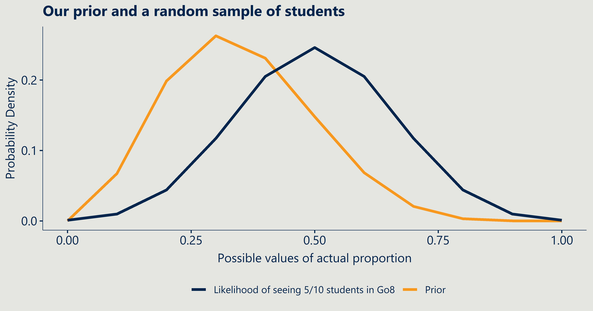
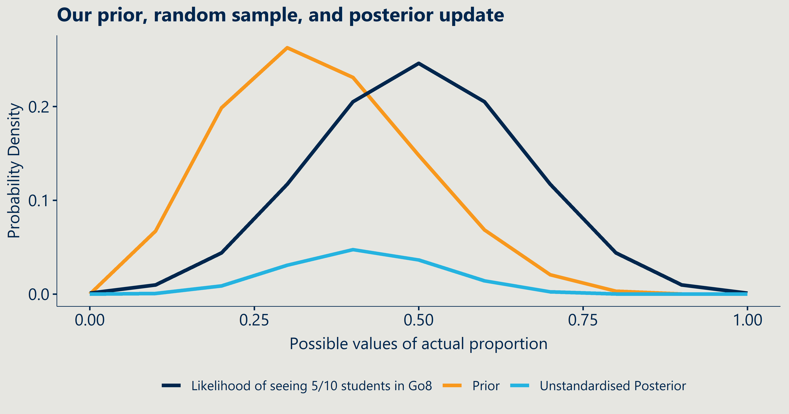
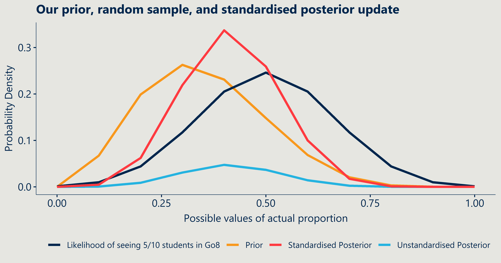
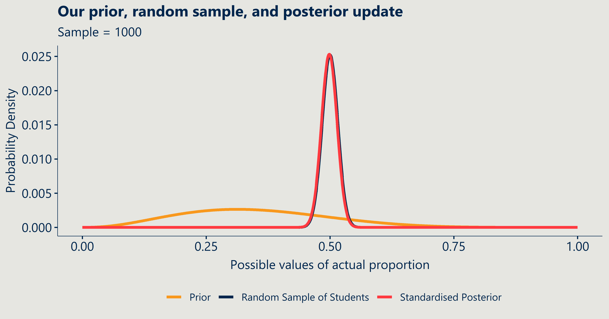
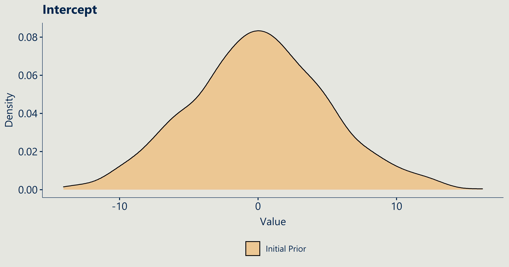
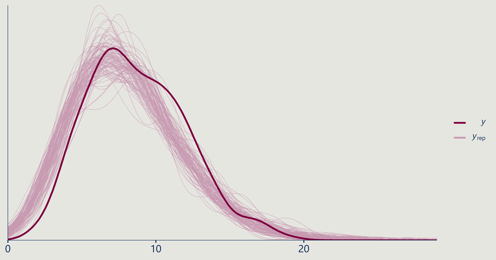
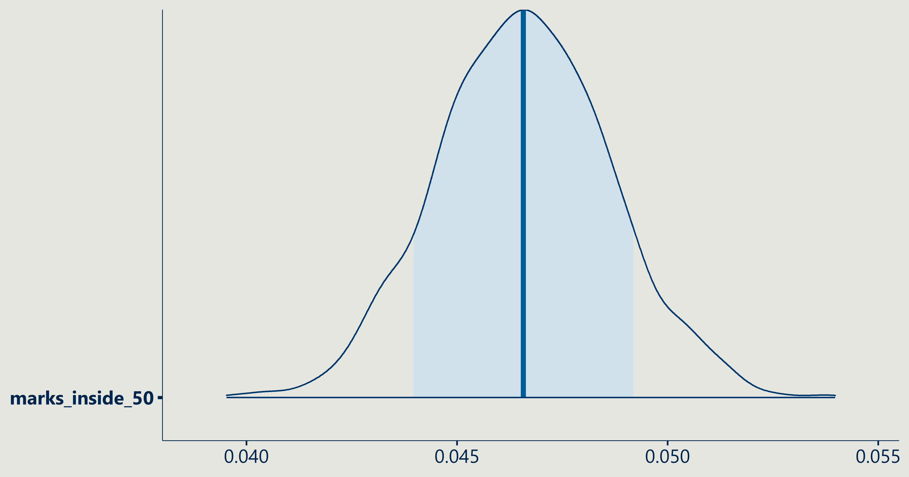
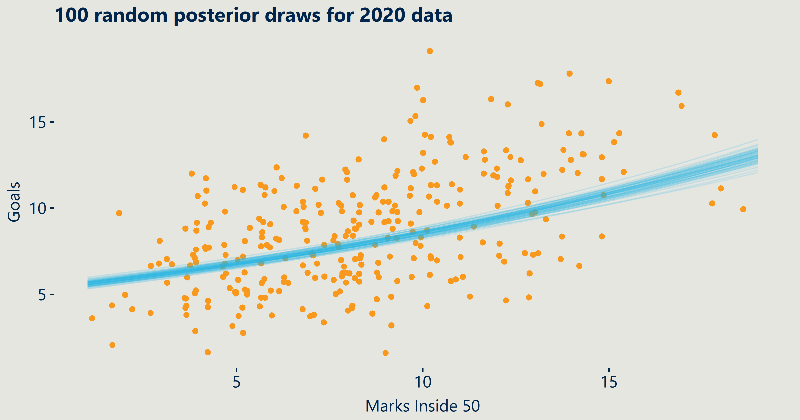

<style>
.small-code pre code {
  font-size: 1em;
}
</style>

Intro to Bayesian Analysis in R
========================================================
author: Trent Henderson
date: 29 January 2021
autosize: true
css: corp-styles.css
transition: linear

Goals of the presentation
========================================================
class: small-code

This interactive talk aims to help you achieve three things:

- Develop an initial understanding of Bayes rule and how to apply it
- Develop an intuition for when to consider a Bayesian approach at Nous
- Understand how to run and interpret basic Bayesian regression models in R

All the code for today is in a [GitLab repository](https://gitlab.com/Henderson.T/r-club-intro-bayes).


When to consider Bayesian statistics at Nous
========================================================

If the answer is yes to any of the following, you might want to consider a Bayesian approach for your project:

* Are you receiving drip-feed data that requires you to update your model(s)?
* Do you have strong subject matter knowledge or prior understanding of the relationships of interest you wish to incorporate?
* Is there a large degree of uncertainty to incorporate in the analysis?

Activity: Our prior beliefs
========================================================

## Consider the following question:

**What proportion of all university students in Australia are studying at a Go8?**

* 0.2
* 0.3
* 0.4

Pop your answers in the Teams chat!

Activity: Our prior belief
========================================================
class: small-code

Since we have a few values that are close together, we believe that the **true** proportion could be most likely somewhere around 0.3 but with some variability. We can model this uncertainty using a distribution. `Beta` distributions are ideal for proportion outcomes.


Activity: A sample of data
========================================================
class: small-code

Now let's say we sampled 10 university students and observed whether they were attending a Go8 or not and 5 said they were.



Activity: Combining our belief and the observed data
========================================================
class: small-code

We can multiply our `prior` by the observed data (`likelihood`) to get the `posterior`.



Activity: Updating our beliefs
========================================================
class: small-code

To properly update our beliefs, because we have more than one dimension, we need to standardise our posterior so that the total probability equals one.



Activity: The impact of sample size
========================================================
class: small-code

So far we have used a random sample of 10 students. But what happens if we sample 100?


Activity: The impact of sample size
========================================================
class: small-code

How about 1000? As sample size increases, the impact of the prior on the posterior weakens in comparison to the data/likelihood.



The mathematics of Bayesian statistics
========================================================

Bayesian statistics boils down to [Bayes's Theorem](https://en.wikipedia.org/wiki/Bayes%27_theorem):

$P(\theta \mid D) = \frac{P(D \mid \theta) \cdot P(\theta)}{P(D)}$

Let's break it down formally:

$P(\theta \mid D)$ - this is called the **posterior** (probability of model parameters given the data)

$P(D \mid \theta)$ - this is called the **likelihood** (probability of the data given model parameters)

$P(\theta)$ - this is called the **prior** (our expressed understanding of the probability of model parameters)

$P(D)$ - this is called the **marginal likelihood** (probability of the data)

Mathematical complications
========================================================

The **marginal likelihood** (denominator in Bayes Theorem) is the reason we can't just compute complex Bayesian models easily - it involves summing (integrating) over all the possible values of the distributions. In a trivial single number case it is easy to just add the numbers, but when using higher-dimensional models and complicated prior and likelihood distributions, this becomes analytically impossible.

To get around this, we instead employ sampling algorithms, such as [Markov chain Monte Carlo (MCMC)](https://en.wikipedia.org/wiki/Markov_chain_Monte_Carlo), to simulate a large number of times to approximate the answer instead.

Enough serious talk, more AFL!
========================================================

Now that we have the basics, let's take a look at a basic Bayesian regression in R using the package [`rstanarm`](https://mc-stan.org/rstanarm/). 

`rstanarm` is a package that lets us fit Bayesian regression models using a simple syntax similar to the `glm` function.

## The premise

**We are going to explore the relationship between the number of marks inside 50 and goals scored in the AFL for the 2020 season using data from prior seasons.**

Example: Data extraction
========================================================
class: small-code

Data extraction using the `fitzRoy` package.


```r
# Pull data back to 2017

years <- c(seq(from = 2017, to = 2020, by = 1))
store <- list()

for(i in years){
  
  start_date <- as.character(paste0(i,"-01-01"))
  end_date <- as.character(paste0(i,"-12-01"))
  
  tmp <- get_afltables_stats(start_date = start_date, end_date = end_date) %>%
    clean_names() %>%
    mutate(season = gsub("-.*", "\\1", date),
           season = as.numeric(season))
  
  store[[i]] <- tmp
}

all_seasons <- rbindlist(store, use.names = TRUE)
```

Example: Data aggregation
========================================================
class: small-code


```r
'%ni%' <- Negate('%in%')
the_finals <- c("EF", "SF", "QF", "PF", "GF") # Remove finals as these might influence analysis

# Aggregate data

d <- all_seasons %>%
  filter(round %ni% the_finals) %>%
  mutate(uniqueid = paste0(season,"_",round,"_",home_team,"_",away_team)) %>%
  group_by(season, round, playing_for, uniqueid) %>%
  summarise(goals = sum(goals),
            marks_inside_50 = sum(marks_inside_50)) %>%
  ungroup()
```

Example: Prior specification
========================================================
class: small-code

Since I expect a positive relationship, here is my prior distribution for the model intercept.



Example: Basic visualisation
========================================================
class: small-code

And here is my prior for the regression coefficient.


Example: Initial Bayesian model fit
========================================================
class: small-code

We can fit a model on the data with my pretty vague priors to get started. Note the familiar syntax to your standard `glm` in `R`.


```r
historical <- d %>%
  filter(season != 2020)

m1 <- stan_glm(goals ~ marks_inside_50,
               data = historical, family = neg_binomial_2,
               prior = normal(0.03,0.01), prior_intercept = normal(1.5,0.5),
               chains = 3, seed = 123)
```

Example: Initial Bayesian model fit
========================================================
class: small-code

We can compare our prior with the posterior. Here is the intercept.


Example: Initial Bayesian model fit
========================================================
class: small-code

And here is the coefficient.


Example: Using historical posterior as new prior
========================================================
class: small-code

We can now extract the posterior information from the historical model to use as the 2020 model prior.


```r
hist_post_agg <- as.data.frame(m1) %>%
  clean_names() %>%
  summarise(alpha_mean = mean(intercept),
            alpha_sd = sd(intercept),
            beta_mean = mean(marks_inside_50),
            beta_sd = sd(marks_inside_50))

season2020 <- d %>%
  filter(season == 2020)

m2 <- stan_glm(goals ~ marks_inside_50,
               data = season2020, family = neg_binomial_2,
               prior = normal(location = hist_post_agg$beta_mean, scale = hist_post_agg$beta_sd),
               prior_intercept = normal(location = hist_post_agg$alpha_mean, scale = hist_post_agg$alpha_sd),
               chains = 3, seed = 123)
```

Example: Using historical posterior as new prior
========================================================
class: small-code

And a final comparison of our initial prior, the historical data posterior (which became the 2020 model prior) and the 2020 posterior. Here is the intercept.


Example: Using historical posterior as new prior
========================================================
class: small-code

And the regression coefficient.


Example: Model diagnostics
========================================================
class: small-code

We can check if the chains mixed in one line of `R` code. We want these just to look like white noise, which they do here.


```r
color_scheme_set("mix-blue-pink")
mcmc_trace(m2, facet_args = list(nrow = 2, labeller = label_parsed))
```



Example: Model diagnostics
========================================================
class: small-code

We can further test how well our simulated data tracks against the real data.


```r
ppc_dens_overlay(y = m2$y,
                 yrep = posterior_predict(m2, draws = 100))
```



Example: Plotting posteriors automatically
========================================================
class: small-code

Here is the coefficient posterior with shaded 80% credible intervals. Credible intervals specify the probability with which the true value lies (compared to 'confidence intervals' which are *not* probability distributions).


```r
mcmc_areas(m2, pars = "marks_inside_50", prob = 0.8)
```



Example: Our model against the actual data
========================================================
class: small-code


```r
season2020 %>%
  data_grid(marks_inside_50 = modelr::seq_range(marks_inside_50, n = nrow(season2020)), goals) %>%   
  add_fitted_draws(m2, n = 100) %>%
  ggplot(aes(x = marks_inside_50, y = goals)) +
  geom_jitter(data = season2020, colour = nous_colour("C3"), position = "jitter")+
  geom_line(aes(y = .value, group = .draw),alpha = 0.1,color = nous_colour("S5"))+
  labs(title = "100 random posterior draws for 2020 data",x = "Marks Inside 50",
       y = "Goals")
```


Final remarks
========================================================

There is much, much more to learn in Bayesian statistics and many other ways to evaluate models. This session hopefully served as a primer to either inspire you to learn more, or to at least consider using Bayesian approaches on current/future Nous projects.

If you want to know more or want advice on implementing Bayes into your projects, feel free to reach out to [myself](trent.henderson@nousgroup.com.au), [Peter Ellis](peter.ellis@nousgroup.com.au), [Martin Burgess](martin.burgess@nousgroup.com.au), [Athol Whitten](athol.whitten@nousgroup.com.au) or other Bayesian Nousers who I accidentally (sorry!) left out here.

**Using Bayes' Theorem doesn't make you a Bayesian. Quantifying uncertainty with probability makes you a Bayesian** - Michael Betancourt
